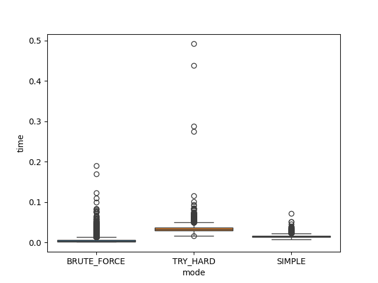

# SUDOKU SOLVER

This project contains a Python-based program developed to solve Sudoku quizzes. The primary objective of the program is to solve all quizzes from [this Sudoku dataset from Kaggle](https://www.kaggle.com/datasets/bryanpark/sudoku?resource=download). The script at `scripts/sudoku_solver.py` is a program which has the logic implemented to solve Sudoku quizzes from `.xlsx` files or images of the Sudoku quiz taken from [sudoku.com](https://sudoku.com/). Images must contain only the Sudoku quiz for the program to work correctly with the image input. The file at `./inputs/image/extreme.png` is an example of such a quiz. The program has successfully solved quizzes of the most challenging difficulty, which is Extreme. A simple web app version of the program was also made.

## SETUP

After cloning repo, run the following to setup everything for the web app to work.

``` bash
docker build -t ss_app .
docker run -p 5000:5000 ss_app:latest
```

Then go to [`http://127.0.0.1:5000`](http://127.0.0.1:5000) in your browser. You can now visit [sudoku.com](https://sudoku.com/), take a screenshot of a Sudoku grid, and try solving it with the web app or input a Sudoku quiz manually.

# Notebooks
The directory `./notebooks/` contains 3 notebooks:
1. For solving all 1 million quizzes from [this dataset](https://www.kaggle.com/datasets/bryanpark/sudoku?resource=download)
2. Training a digit classifier
3. Detailing the process of solving sudoku quizzes from image

# The Algorithm 
One way to solve a Sudoku quiz is through brute force. This approach recursively fills in cell values until a valid final solution is found.

My algorithm for solving Sudoku quizzes is based on reducing the possibilities of each unsolved cell. In its simplest form, the algorithm uses the filled-in values of rows, columns, and regions to narrow down the possibilities. I call this the "Simple" approach. If it reaches a point where it can't reduce the possibilities further, it uses brute force to complete the quiz.

The more advanced version of my algorithm introduces the "naked pair" method; see [this](https://masteringsudoku.com/sudoku-solving-techniques/) guide, to further reduce possibilities. Additionally, if an unsolved cell contains the only possible value for a row, column, or region, it can be filled immediately. I call this the "Try Hard" approach. Similarly to the "Simple" approach, if it reaches a point where it can't reduce the possibilities further, it uses brute force to complete the quiz.

The quizzes in [this](https://www.kaggle.com/datasets/bryanpark/sudoku?resource=download) dataset are relatively simple and can be solved using the "Simple" or "Try Hard" approach, without resorting to brute force. All of the approaches, therefore, are able to successfully solve all the quizzes in this dataset.

## A Note on Performance

### Solving the Dataset quizes
When solving 10,000 quizzes from the dataset using the three different approaches, we observe the following:

| Method       | Mean     | Std      | Min      | 25%      | 50%      | 75%      | Max      |
|--------------|---------:|---------:|---------:|---------:|---------:|---------:|---------:|
| BRUTE_FORCE  | 0.005931 | 0.007082 | 0.001258 | 0.002483 | 0.003826 | 0.006652 | 0.190458 |
| SIMPLE       | 0.015369 | 0.003520 | 0.008325 | 0.013011 | 0.014787 | 0.017011 | 0.071318 |
| TRY_HARD     | 0.033976 | 0.010041 | 0.015980 | 0.029025 | 0.032977 | 0.037360 | 0.491866 |

Brute Force has the fastest average solution time, but it occasionally takes much longer on some cases.

Simple is slightly slower on average, but it is more consistent and reliable, always solving the puzzles without extreme outliers.

Try Hard is the slowest on average and shows the largest variability.

The boxplot below illustrates the distribution of solution times for each approach.



### When trying to an Extreme Quiz
When trying to solve a quiz of "Extreme" difficulty, like the one saved at `inputs/images/quiz_extreme.png`, the performance of the "Try Hard," "Simple," and "Brute Force" approaches is as follows:

| Method       | Time to find the solution (s) |
|--------------|-------------------------------|
| Brute Force  | 6.223                         |
| Simple       | 3.889                         |
| Try Hard     | 0.271                         |

In this case, the "Brute Force" approach performed poorly due to the order in which the recursion explored the options. Because this quiz is so difficult, the "Simple" approach had to rely on brute force to solve it. The "Try Hard" approach is significantly faster for this quiz compared to both the "Brute Force" and "Simple" approaches, as it can significantly reduce the number of possibilities before relying on brute force to complete the puzzle. Due to the potential for inefficient solution exploration through recursion with the brute force method, the "Try Hard" approach is more reliable. Therefore the "Try Hard" approach is my preffered method to reliably solve sudoku quizzes.

## Future Ideas

1. Get the program to work for images of printed sudoku quizzes, e.g those found in magazines or newspapers.
2. Speed up 'image-to-quiz' process, by using a better method than detecting Harris Corners.
3. Reduce the size of the Docker image for the web app by choosing a lighter base image and only using the necessary requirements.
